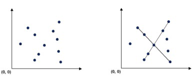

# Pattern Recognition

Given a set of P feature points in the bidimensional plane, determine every line that contains at least N or
more COLLINEAR points.



## Installation

Use the package manager npm to install patter-recognition.

```bash
npm install
```

## Usage

Run the `start` script to launch the REST API server.

```bash
npm run start
```

## Solution

The algorithm is not the fastest but I chosen to check the angle between each group of three points in the space to check the collinear condition:


This is to involved array operations mainly and brush up some algebra concepts from the middle School :satisfied:

I added comments where needed and the core file is the `maths.js` one: from the points collection in the space, I take the bigger combination of them until I found the longest line segment or I reach the desired minimum number of collinear points.

## License

[MIT](https://choosealicense.com/licenses/mit/)
